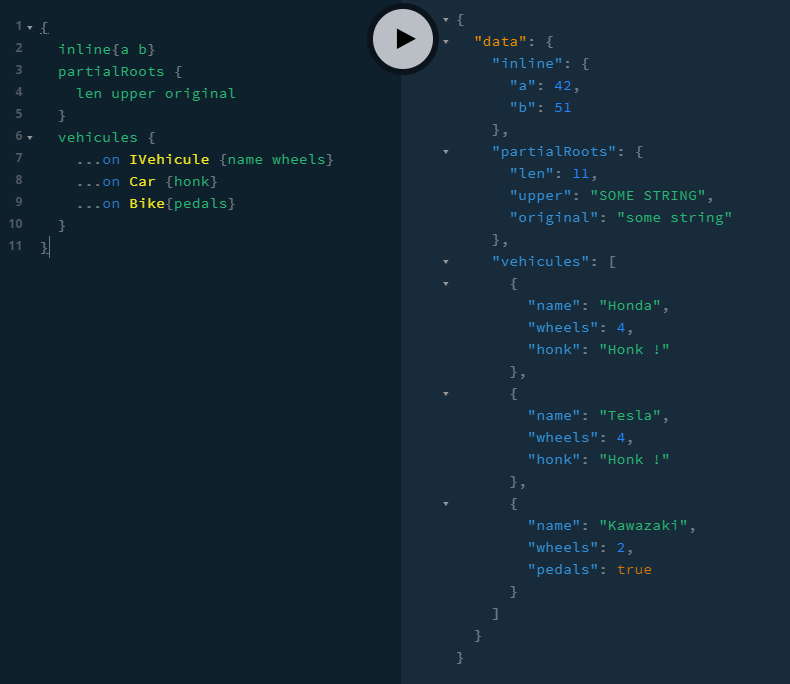

This sample demonstrates how to use both `inversify-graphql/shortcuts` module and more complex types.

**NOTA BENE:** This barely demonstrates how to actually use injection (only on `BikeType` class). It is rather a set of examples of how to mix more complex inversified types.

To run it:

```
git clone git@github.com:oguimbal/inversify-graphql.git
cd inversify-graphql
npm i
npm run sample-complex
```

(or just press F5 when in vscode with the right configuration)

You should then be able to navigate GraphiQL via http://localhost:3000/

Try typing the below request:

```graphql
{
  inline{a b}
  partialRoots {
    len upper original
  }
  vehicules {
    ...on IVehicule {name wheels}
    ...on Car {honk}
    ...on Bike{pedals}
  }
}
```


